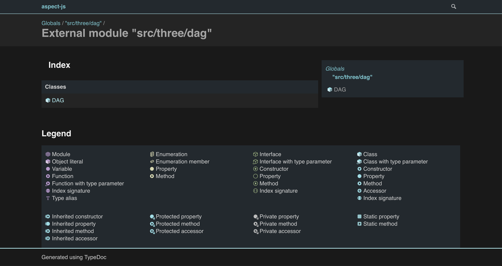
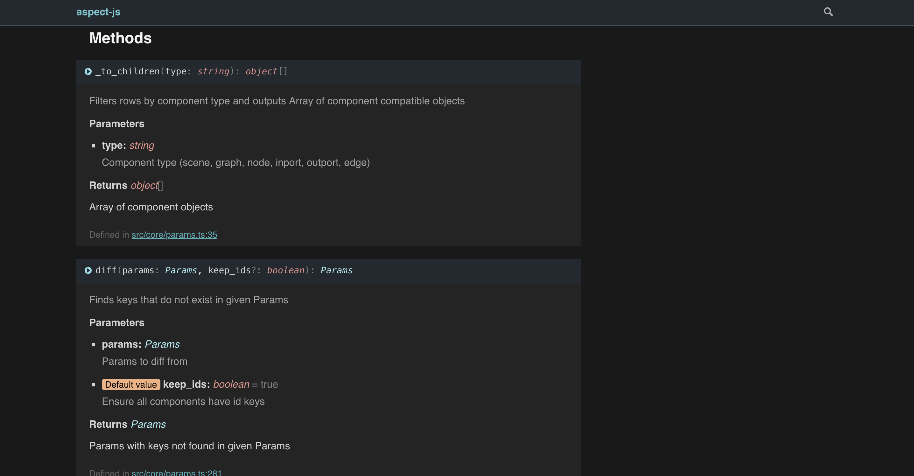
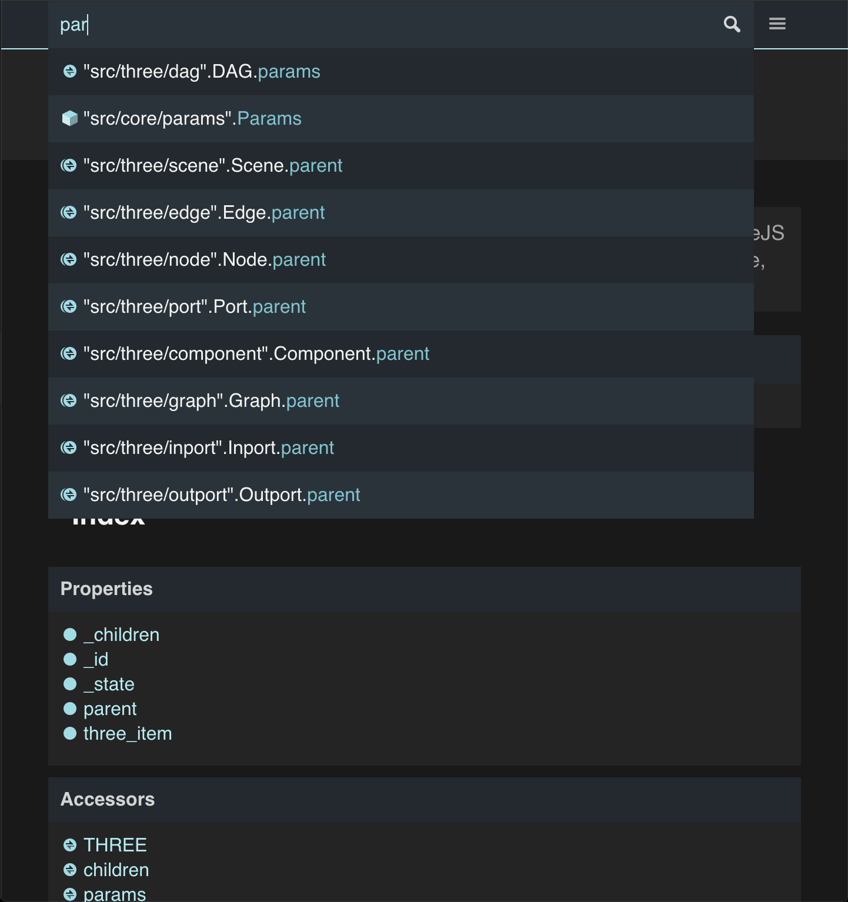
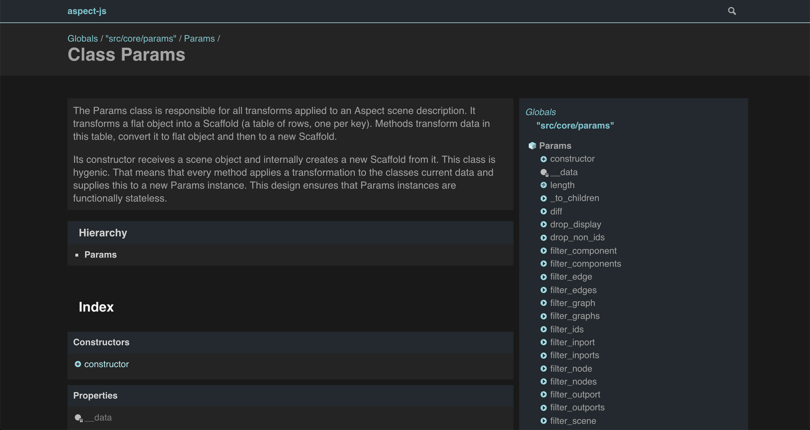
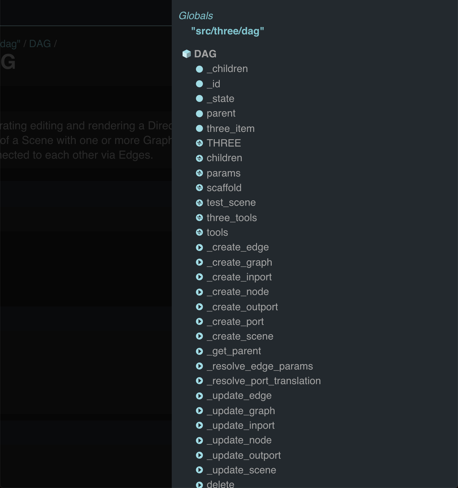

# Henanigans theme for TypeDoc

[TypeDoc](http://typedoc.io/) is a documentation generator for TypeScript projects.

## Usage

```bash
$ npm install typedoc typedoc-henanigans-theme --save-dev
$ node_modules/.bin/typedoc --theme node_modules/typedoc-henanigans-theme/bin/default --out doc path/to/ts/dir
```

See TypeDoc documentation (http://typedoc.io/) to learn more about TypeDoc.

## Screenshots

---

---

---

---

